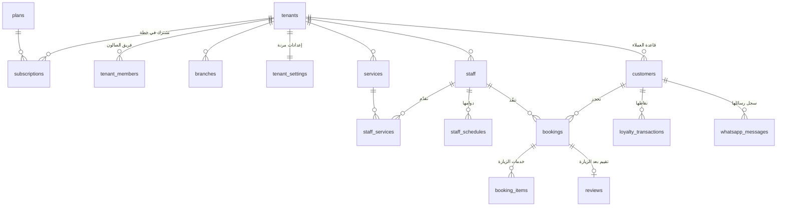

# مخطط قاعدة البيانات — المرحلة 0

قاعدة بيانات PostgreSQL على Supabase، متعددة المستأجرين: كل جدول يحمل `tenant_id`
وكل العزل يتم بسياسات Row Level Security — لا يعتمد الأمان على كود التطبيق إطلاقًا.

## خريطة النطاقات (33 جدول + 1 view)

| النطاق | الجداول |
|---|---|
| **المنصة** (لوحتك أنت) | `platform_admins` · `plans` · `tenants` · `subscriptions` · `tenant_members` |
| **نواة الصالون** | `branches` · `tenant_settings` · `categories` · `services` · `staff` · `staff_services` · `staff_schedules` · `staff_time_off` |
| **CRM** | `customers` · `customer_tags` · `customer_tag_links` · `customer_notes` · view `customer_segments` |
| **الحجوزات** ⭐ | `bookings` · `booking_items` · `booking_holds` · `waitlist` |
| **الولاء والنمو** | `loyalty_transactions` · `gift_cards` · `coupons` · `coupon_redemptions` · `packages` · `package_services` · `customer_packages` · `referrals` · `reviews` |
| **الواتساب** | `whatsapp_templates` · `campaigns` · `whatsapp_messages` |

## العلاقات الأساسية



## القرارات التصميمية المهمة

### 1. منع تعارض الحجوزات في قاعدة البيانات نفسها
قيد `EXCLUDE USING gist` على `bookings`: لا يمكن لحجزين فعّالين
(pending / confirmed / in_progress) أن يتداخلا زمنيًا لنفس الموظفة — حتى لو وصل
طلبان في نفس اللحظة من جهازين، قاعدة البيانات سترفض الثاني. هذا أقوى من أي فحص
في كود التطبيق.

### 2. شكل الحجز
- **عدة خدمات بزيارة واحدة** → صف `bookings` واحد + عدة `booking_items` (لقطة اسم وسعر الخدمة وقت الحجز).
- **حجز جماعي** (عروس وصديقاتها مع عدة موظفات بنفس الوقت) → عدة صفوف `bookings` تشترك في `group_id`.
- **قفل الموعد أثناء الدفع** → `booking_holds` بصلاحية 5 دقائق؛ دالة التوفر تستثنيها، وتُنظف بـ pg_cron.

### 3. نموذج الأدوار
- `platform_admins`: أنت — وصول كامل لكل شيء (سياسة عامة على كل الجداول).
- `tenant_members`: فريق الصالون بأربعة أدوار — owner / manager (إدارة كاملة)، receptionist (العمليات اليومية: حجوزات وعملاء)، staff (بوابة الموظفة فقط).
- العميلة ليست عضوًا: صفّها في `customers` مرتبط بحسابها عبر `user_id`، وترى بياناتها وحجوزاتها فقط.
- الزائر (anon): يقرأ فقط ما تعرضه صفحة الصالون العامة (الخدمات، الموظفات، التقييمات المنشورة، الباقات).

### 4. حماية الحقول الحساسة
سياسة RLS لا تستطيع تقييد أعمدة بعينها، لذلك تريغر `protect_customer_fields`
يمنع العميلة من تعديل نقاطها/محفظتها/مستواها حتى لو عدّلت صفّها — التعديل
مسموح فقط للإدارة وللعمليات الداخلية (تريغرات ودوال النظام).

### 5. الكتابة الحساسة عبر RPC لا insert مباشر
إنشاء الحجوزات من واجهة العميلة، استخدام الكوبونات، واستهلاك بطاقات الهدايا —
كلها ستكون دوال `security definer` ذرّية (المرحلة 1+) تتحقق من التوفر والأسعار
داخل معاملة واحدة. لذلك لا توجد سياسات insert مباشرة للعميلات على هذه الجداول.

### 6. أرقام مشتقة لا تُحرر يدويًا
- `customers.points_balance` يتحدث حصريًا من دفتر `loyalty_transactions` (تريغر).
- `visits_count` و`total_spent` و`last_visit_at` و`no_show_count` تتحدث من انتقالات حالة الحجز (تريغر).
- شريحة العميلة (جديدة/نشطة/معرضة للفقدان/مفقودة) view محسوب `customer_segments` — لا تتقادم أبدًا.

### 7. صالون جديد = جاهز فورًا
تريغر على `tenants`: أي صالون يُضاف تُنشأ له إعداداته الافتراضية + قوالب
الواتساب الست بنصوص عربية جاهزة (تأكيد، تذكيران، شكر وتقييم، اشتقنا لك، عيد ميلاد)
— والمدير يحررها من لوحته.

### 8. مفاتيح أجنبية مركبة — عزل على مستوى العلاقات نفسها
كل علاقة بين جدولين داخل الصالون تمر عبر `(tenant_id, id)` وليس `id` وحده.
النتيجة: يستحيل فيزيائيًا ربط حجز في صالون بعميلة أو موظفة من صالون آخر،
حتى لو وُجد خطأ في كود التطبيق أو سياسة RLS. (اختبار العزل رقم 12 يثبت ذلك.)

### 9. تفاصيل تشغيلية
- الجوال يُخزن منسقًا دوليًا `+9665XXXXXXXX` وفريد داخل الصالون `unique (tenant_id, phone)` — التطبيع في طبقة التطبيق.
- `bookings` و`booking_holds` مضافان لقناة Realtime — تقويم الإدارة يتحدث لحظيًا.
- `tenant_settings.features` مفاتيح الصالون نفسه، و`plans.features` ما تسمح به خطته — الميزة تعمل فقط إذا سمح الاثنان (التقاطع في طبقة التطبيق).
- عتبات مستويات الولاء ومعدل تحويل النقاط قابلة للتخصيص لكل صالون في `tenant_settings.loyalty`.

## المرحلة 1 — محرك الحجوزات (منفذة ✅)

في `20260611001000_booking_engine.sql`:

| الدالة | دورها |
|---|---|
| `get_available_slots(tenant, services[], date, staff?)` | الأوقات المتاحة = دوام − حجوزات فعّالة − راحات − إجازات معتمدة − أقفال. `staff = null` تعني أي موظفة مؤهلة لكل الخدمات المطلوبة. متاحة للزوار (مسار الحجز قبل الدخول). |
| `hold_slot(...)` | قفل الموعد 5 دقائق أثناء إتمام الحجز، مع قفل استشاري (`pg_advisory_xact_lock`) على الموظفة يمنع سباق طلبين متزامنين. |
| `create_booking(...)` | ذرّي بالكامل: يتحقق من العميلة والموظفة وخدماتها والأسعار من القاعدة (لا يثق بالواجهة)، يحسب العربون من إعدادات الصالون، وعند السباق يلتقط `exclusion_violation` ويعيد رسالة عربية لطيفة. الإدارة تمرر `p_customer` للحجوزات الهاتفية. |
| `cancel_booking(...)` | العميلة: ضمن مهلة الإلغاء من إعدادات صالونها فقط. الإدارة: في أي وقت. |
| `cleanup_expired_holds()` | تنظيف الأقفال المنتهية — مجدولة بـ pg_cron كل 10 دقائق. |

وحارسان على `bookings`:
- `validate_booking_transition`: دورة حياة صارمة (لا تراجع عن مكتمل/ملغي/لم تحضر).
- `protect_booking_fields`: الموظفة تغيّر الحالة والملاحظة الداخلية فقط — لا المبالغ ولا الأوقات.

### الاختبارات
`supabase/tests/booking_engine_test.sql` — 12 اختبارًا تغطي: حساب التوفر والراحات،
التعارض عبر الدالة وعبر الإدخال المباشر (سباق)، الأقفال المؤقتة واستهلاكها، دورة
الحياة وتحديث إحصائيات العميلة، قواعد الإلغاء وعودة الوقت للمتاح، تقييد التقييمات
بالحجوزات المكتملة، دفتر النقاط، والعزل بين الصالونات. كلها داخل معاملة تُلغى —
لا تترك أثرًا.

```bash
docker exec -i supabase_db_salon-saas psql -U postgres -d postgres \
  < supabase/tests/booking_engine_test.sql
```

## ما يأتي لاحقًا
- المرحلة 0ب: هيكل Next.js + الـ Subdomain الديناميكي، ثم واجهة الزبائن (المرحلة 2).
- RPCs الكوبونات وبطاقات الهدايا (مرحلة الولاء) — البنية جاهزة.
- جدول `payments` لحركات الدفع الفعلية (Moyasar/Tap webhooks) — يُضاف في مرحلة الدفع.
